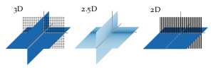

**Figure 2.3**: Sound pressure in decibel
for secondary source distributions with
different dimensionality all driven by
the same signals. The sound pressure is
color coded, lighter color corresponds
to lower pressure. In the 3D case a planar distribution of point sources is
applied, in the 2.5D case a linear distribution of point sources, and in the 2D case
a linear distribution of line sources.

## Steps for reproduction

The final figure is arranged in the svg file. In order to simulate the sound
pressure for different geometries you can run the following two commands and
compare it with the svg file.

Matlab/Octave:
```Matlab
>> sound_field_dimensionality
```

Bash:
```Bash
$ gnuplot sound_field_dimensionality.gnu
```
