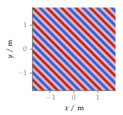

**Figure 2.4**: Sound pressure for a
monochromatic plane wave (2.30) going
into the direction (1,1,0). Parameters:
f = 800 Hz.

## Steps for reproduction

Matlab/Octave:
```Matlab
>> sound_field_plane_wave
```

Bash:
```Bash
$ gnuplot sound_field_plane_wave.gnu
```
