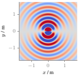

**Figure 2.6**: Sound pressure for a
monochromatic dipole source (2.39)
placed at (0,0,0). Parameters:
f = 800 Hz.

## Steps for reproduction

Matlab/Octave:
```Matlab
>> sound_field_dipole_source
```

Bash:
```Bash
$ gnuplot sound_field_dipole_source.gnu
```
