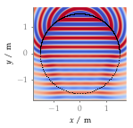

**Figure 2.9**: Sound pressure for a
monochromatic point source synthesized by 2.5D NFC-HOA (2.50).
Parameters: x_s = (0,2.5,0) m, x_ref = (0,0,0),
f = 1 kHz.

## Steps for reproduction

Matlab/Octave:
```Matlab
>> sound_field_nfchoa_ps
```

Bash:
```Bash
$ gnuplot sound_field_nfchoa_ps.gnu
```
