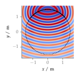

**Figure 2.12**: Sound pressure for a
monochromatic line source synthesized
by 2.5D WFS (2.67). Parameters: x_s =
(0,2.5,0) m, x_ref = (0,0,0), f = 1 kHz.

## Steps for reproduction

Matlab/Octave:
```Matlab
>> sound_field_wfs_ls
```

Bash:
```Bash
$ gnuplot sound_field_wfs_ls.gnu
```
