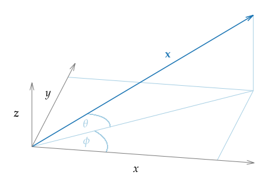

.. _sec-mathematical-definitions:

Mathematical Definitions
------------------------

.. _sec-coordinate_system:

Coordinate system
~~~~~~~~~~~~~~~~~

:numref:`fig-coordinate-system` shows the coordinate system that is used in the
following chapters. A vector :math:`\x` can be described by its position
:math:`(x,y,z)` in space or by its length, azimuth angle :math:`\phi \in
[0,2\pi[`, and elevation :math:`\theta \in
\left[-\frac{\pi}{2},\frac{\pi}{2}\right]`.  The azimuth is measured
counterclockwise and elevation is positive for positive :math:`z`-values.

.. _fig-coordinate-system:

    Coordinate system used in this document. The vector :math:`x` can also be
    described by its length, its azimuth angle :math:`\phi`, and its elevation
    :math:`\theta`.

.. _sec-fourier-transform:

Fourier transformation
~~~~~~~~~~~~~~~~~~~~~~

Let :math:`s` be an absolute integrable function, :math:`t,\w` real
numbers, then the temporal Fourier transform is defined after
:cite:`Bracewell2000` as

.. math::
    :label: fft

    S(\w) = \mathcal{F}\left\{s(t)\right\} =
        \int^{\infty}_{-\infty} s(t) \e{-\i\w t} \d t.

In the same way the inverse temporal Fourier transform is defined as

.. math::
    :label: ifft

    s(t) = \mathcal{F}^{-1}\left\{S(\w)\right\} =
        \frac{1}{2\pi} \int^{\infty}_{-\infty} S(\w)
        \e{\i\w t} \d\w.

.. vim: filetype=rst spell:
