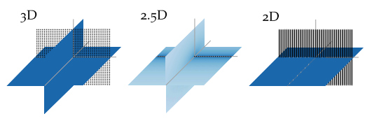

.. _sec-dimensionality:

Sound Field Dimensionality
--------------------------

The single-layer potential :eq:`single-layer` is valid for all :math:`V \subset
{\mathbb{R}}^n`.  Consequentially, for practical applications a two-dimensional
(2D) as well as a three-dimensional (3D) synthesis is possible. Two-dimensional
is not referring to a synthesis in a plane only, but describes a setup that is
independent of one dimension. For example, an infinite cylinder is independent
of the dimension along its axis. The same is true for secondary source
distributions in 2D synthesis.  They exhibit line source characteristics and are
aligned in parallel to the independent dimension. Typical arrangements of such
secondary sources are a circular or a linear setup.

The characteristics of the secondary sources limit the set of possible sources
which can be synthesized. For example, when using a 2D secondary source setup it
is not possible to synthesize the amplitude decay of a point source.

For a 3D synthesis the involved secondary sources depend on all dimensions and
exhibit point source characteristics. In this scenario classical secondary
sources setups would be a sphere or a plane.

.. _sec-25d-synthesis:

2.5D Synthesis
~~~~~~~~~~~~~~

.. _fig-sound-field-dimensionality:

    Sound pressure in decibel for secondary source distributions with different
    dimensionality all driven by the same signals. The sound pressure is color
    coded, lighter color corresponds to lower pressure. In the 3D case a planar
    distribution of point sources is applied, in the 2.5D case a linear
    distribution of point sources, and in the 2D case a linear distribution of
    line sources.

In practice, the most common setups of secondary sources are 2D setups,
employing cabinet loudspeakers. A cabinet loudspeaker does not show the
characteristics of a line source, but of a point source. This dimensionality
mismatch prevents perfect synthesis within the desired plane. The combination of
a 2D secondary source setup with secondary sources that exhibit 3D
characteristics has led to naming such configurations *2.5D synthesis*
:cite:`Start1997`. Such scenarios are associated with a wrong amplitude decay
due to the inherent mismatch of secondary sources as is highlighted in
:numref:`fig-sound-field-dimensionality`. In general, the amplitude is only
correct at a given reference point :math:`\xref`.

For a circular secondary source distribution with point source characteristic
the 2.5D driving function can be derived by introducing expansion coefficients
for the spherical case into the driving
function :eq:`fd-drivingfunction-circular`. The equation is than solved for
:math:`\theta = 0{^\circ}` and :math:`r_\text{ref} = 0`. This results in a 2.5D
driving function given after :cite:`Ahrens2012`, eq. (3.49) as

.. math::
    :label: fd-drivingfunction-circular-25d

    D_{\text{circular},\text{2.5D}}(\phi_0,\w) = \frac{1}{2\pi R_0}
        \sum_{m=-\infty}^\infty \frac{\breve{S}_{|m|}^m
        (\frac{\pi}{2},\phi_\text{s},r_\text{s},\w)}{\breve{G}_{|m|}^m
       (\frac{\pi}{2},0,\w)} \Phi_m(\phi_0).

For a linear secondary source distribution with point source characteristics the
2.5D driving function is derived by introducing the linear expansion
coefficients for a monopole source :eq:`point-linear-coefficients` into
the driving function :eq:`fd-drivingfunction-linear` and solving the equation
for :math:`y = y_\text{ref}` and :math:`z = 0`. This results in a 2.5D driving
function given after :cite:`Ahrens2012`, eq. (3.77) as

.. math::
    :label: fd-drivingfunction-linear-25d

    D_{\text{linear},\text{2.5D}}(x_0,\w) = \frac{1}{2\pi}
        \int_{-\infty}^\infty \frac{\breve{S}(k_x,y_\text{ref},0,\w)}
        {\breve{G}(k_x,y_\text{ref},0,\w)} \chi(k_x,x_0) \d k_x.

A driving function for the 2.5D situation in the context of |WFS| and arbitrary
2D geometries of the secondary source distribution can be achieved by applying
the far-field approximation  :math:`\Hankel{2}{0}{\zeta} \approx
\sqrt{\frac{2\i}{\pi\zeta}} \e{-\i\zeta}` for
:math:`\zeta \gg 1` to the 2D Green’s function :cite:`Williams1999`, eq. (4.23).
Using this the following relationship between the 2D and 3D Green’s functions
can be established.

.. math::
    :label: 25d-approximation

    \begin{gathered}
        \underbrace{-\frac{\i}{4} \;
            \Hankel{2}{0}{\wc |\x-\x_0|}}_{G_\text{2D}(\x-\x_0,\w)}
        \approx
        \sqrt{2\pi\frac{c}{\i\w} |\x-\x_0|} \;
        \underbrace{
            \frac{1}{4 \pi}
            \frac{\e{-\i\wc |\x-\x_0|}}
            {|\x-\x_0|}}_{G_\text{3D}(\x-\x_0,\w)},
    \end{gathered}

where :math:`\Hankel{2}{0}{}` denotes the Hankel function of second kind and
zeroth order. Inserting this approximation into the single-layer potential for
the 2D case results in

.. math::
    :label: single-layer-25d

    P(\x,\w) = \oint_S \sqrt{2\pi\frac{c}{\i\w}
        |\x-\x_0|} \; D(\x_0,\w) G_\text{3D}(\x-\x0,\w) \d A(\x_0).

If the amplitude correction is further restricted to one reference point
:math:`\xref`, the 2.5D driving function for |WFS| can be formulated as

.. math::
    :label: fd-drivingfunction-wfs-25d

    D_\text{2.5D}(\x_0,\w) = \underbrace{\sqrt{2\pi|\xref-\x_0|}}_{g_0}
        \sqrt{\frac{c}{\i\w}} \, D(\x_0,\w),

where :math:`g_0` is independent of :math:`\x`.

.. vim: filetype=rst spell:
