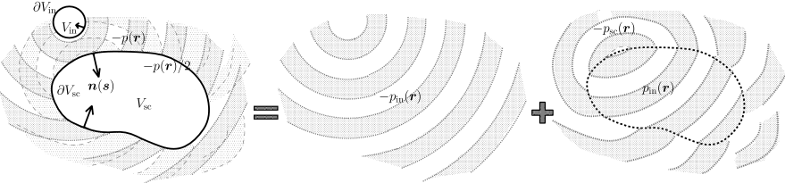

Welcome to the Sound Field Synthesis Toolbox
============================================

 
Sound field synthesis (SFS) includes methods that try to generate a defined
sound field in an extended area that is surrounded by loudspeakers. This project
focuses on those methods that provide analytical solutions to the underlying
mathematical problem, namely |WFS|, |NFC-HOA|, and the |SDM|.

The SFS Toolbox project is structured in the following three sub-projects.

Overview and Theory:
    https://sfs.readthedocs.io (current page)

SFS Toolbox for Matlab/Octave:
    https://sfs-matlab.readthedocs.io

SFS Toolbox for Python:
    https://sfs-python.readthedocs.io

The Toolboxes provide you with the implementation of the underlying mathematics.
You can make numerical simulations of the resulting sound fields and can even
create binaural simulations of the same sound fields. This enables you to listen
to large loudspeaker arrays, even if you don’t have one in your laboratory or at
home. In addition, you can easily plug-in your own algorithms in order to test
or compare them.

The :ref:`theory section <theory>` introduces the underlying physical principles
of sound field synthesis and derives all of the so called driving functions that
determine the actual loudspeaker signals. Most of them are implemented in the
Toolboxes and comments in the code link back to the corresponding equations.
A lot of the figures in the :ref:`theory section <theory>` are directly created
by the SFS Toolbox for Python. All of them display the corresponding code for
creating them directly before the actual figure. In order to recreate them, you
have to execute the following code first:

.. Common plotting settings
.. plot::
    :context: reset

    import numpy as np
    import matplotlib.pyplot as plt
    import sfs
    plt.rcParams['figure.figsize'] = 8, 4.5  # inch

The image at the top of the page is extracted from :cite:`Zotter2013`.

----

.. _theory:

Theory
------

The theory is based on Chap. 2 from :cite:`Wierstorf2014`. It is extended and
corrected by the contributions from :cite:`Schultz2016` and should be improved
by further contributions from the community. The complete theory section is also
available as a :get:`pdf`.

You can link to any equation within it by the permalink that becomes visible by
hovering over the corresponding equation number, e.g.
:sfs:`wfs/#equation-D_wfs`. Those links will always work.
If you prefer to reference an equation from the :get:`pdf` instead, please cite
the document with "H. Wierstorf, F. Winter, F. Schultz, N. Hahn, T. Rettberg, C.
Hohnerlein, and S. Spors. *Theory of Sound Field Synthesis*.
`doi:10.5281/zenodo.1112451`_."

.. _`doi:10.5281/zenodo.1112451`: https://doi.org/10.5281/zenodo.1112451

Table of Contents
^^^^^^^^^^^^^^^^^

.. toctree::
    :maxdepth: 3

    contributors
    defs/index
    problem/index
    nfchoa/index
    wfs/index
    dims/index
    sources/index
    d_nfchoa/index
    d_wfs/index
    d_lsfs/index
    refs/index
    
.. vim: filetype=rst spell:
