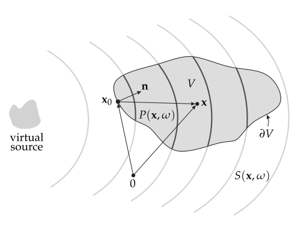

.. _sec-problem-statement:

Problem statement
-----------------

.. _fig-geometry:

    Illustration of the geometry used to discuss the physical fundamentals of
    sound field synthesis and the single-layer potential.

The problem of sound field synthesis can be formulated after as follows. Assume
a volume :math:`V \subset \mathbb{R}^n` which is free of any sources and sinks,
surrounded by a distribution of monopole sources on its surface :math:`\partial
V`. The pressure :math:`P(\x,\w)` at a point :math:`\x\in V` is then given
by the *single-layer potential* (compare p. 39 in :cite:`Colton1998`)

.. math::
    :label: single-layer

    P(\x,\w) = \oint_{\partial V} D(\x_0,\w) G(\x-\x_0,\w)
        \d A(\x_0),

where :math:`G(\x-\x_0,\w)` denotes the sound propagation of the source at
location :math:`\x_0 \in \partial V`, and :math:`D(\x_0,\w)` its weight, usually
referred to as *driving function*. The sources on the surface are called
*secondary sources* in sound field synthesis, analogue to the case of acoustical
scattering problems. The single-layer potential can be derived from the
Kirchhoff-Helmholtz integral :cite:`Williams1999`. The challenge in sound field
synthesis is to solve the integral with respect to :math:`D(\x_0,\w)` for a
desired sound field :math:`P = S` in :math:`V`. It has unique solutions which
:cite:`Zotter2013` explicitly showed for the spherical case and :cite:`Fazi2010`
(Chap.4.3) for the planar case.

In the following the single-layer potential for different dimensions is
discussed. An approach to formulate the desired sound field :math:`S` is
described and finally it is shown how to derive the driving function
:math:`D`.

.. vim: filetype=rst spell:
